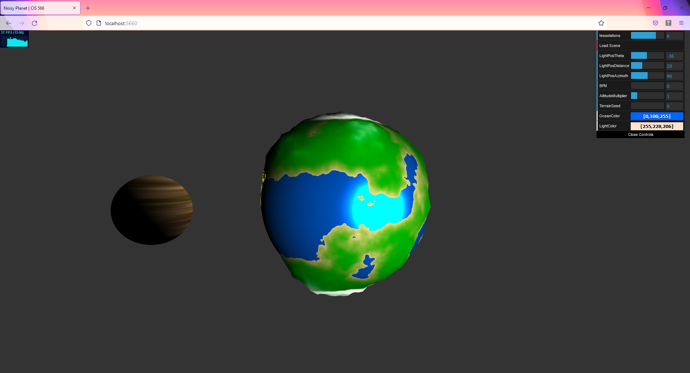

# Tiny Planet

## ScreenShot: 

## Details
- Created by Nathan Devlin, based on original code by Adam Mally
- Written in TypeScript and glsl

- A small planet whose God (you!) can modify at will.
  - Modify Tesselations to increase the detail of the planet (but decrease framerate)
  - Use the 3 LightPos controls to change the position of the Sun according to spherical coordinates
  - BPM allows you to match the beating of the planet to a song of your choice!
      Choose a song and find it's Beats Per Minute. Then set the BPM slider accordingly and your planet will bounce along with the music!
  - Altitude Multiplier allows you to ajust the steepness of the mountains
  - Terrain Seed allows you to change the landscape to change the formation of land masses to your liking
  - Ocean Color gives you RGB controls for the color of the ocean
  - Light Color gives you RGB controls for the color of the sun.

  Try it out and have some fun!

## Live Demo
View a live WebGL Demo here!:
https://ndevlin.github.io/hw01-noisy-planet/

