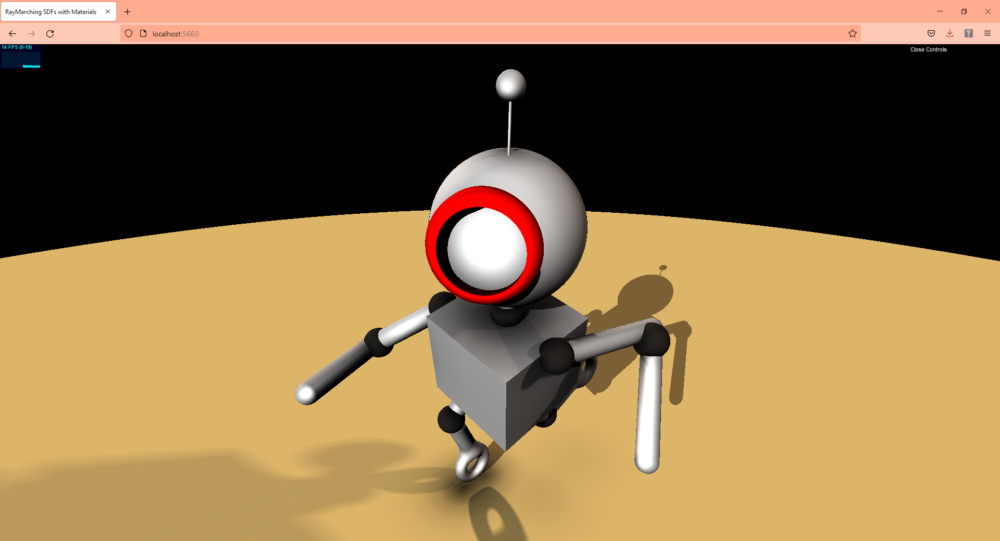

# Nathan Design Doc

## View a live WebGL Demo here!: https://ndevlin.github.io/LiveRayMarching/

## Milestone #2:

- Make progress on algorithms
- Setting up the project was notably more time consuming than expected and getting things working properly took a solid chunk of time. Additionally going through the algorithms to understand them properly I think also took more time than expected.
- With that being said, I believe I am now set up for success and will be able to move a lot quicker with later parts of the implementation.

- Here is an example of one of my features, the ambient occlusion. It takes up a small amount of framerate, and is quite tunable to look very good and to meet the user's desires.

## Design Specification:

### Introduction
- I have been very interested in rendering ever since I started learning about computer graphics, but I haven't had the opportunity to learn as much about rendering as I would like! I really enjoyed our HW2 and HW3 assignments, and I would like to build on those to make a polished SDF scene. I will start with my HW3 project as a base. That will allow me to focus on adding new rendering techniques and not spend so much time creating shapes or simply getting something to show up on screen. I will be implementing this as a solo project.

### Goal
- I would like to learn more about rendering techniques while at the same time showing off my graphics, procedural, and rendering knowledge in a polished project. I am hoping to incorporate some more advanced techniques like depth of field, subsurface scattering, and ambient occlusion into the scene. If time and logistics allow, I will also add some additional features like reflections, shadows, and/or volumetrics.

### Inspiration/reference:
- My starting point will be my HW3 project, and as such, my starting reference will be the robot I created in Maya, seen here

If time and logisics allows, I am considering creating a new SDF scene that would have more complexity and would give more opportunity to show off rendering techniques like subsurface scattering and ambient occlusion. For this, I am considering creating a classic still life scene that I think would have the advantage of having multiple objects close to each other to show off the ambient occlusion, could have objects that would naturally have subsurface scattering, and would enable me to add or remove objects in accordance with the needs of the complexity of my scene. Here is my still life reference, below:

### Specification:
1) Depth of field rendering
    - Implement a simulated depth of field effect
    - Allow the user to change the focal length and/or the aperture

2) Subsurface scattering
    - Impement simulated subsurface scattering
    - Possibly add different materials that have different materials and different amounts of SSS

3) Ambient Occlusion
    - Implement simulated ambient occlusion
    - Tweak amount of ambient occlusion to enhance the scene as best as possible

Possible additional features:

4) Reflections
    - Add simulated reflections to enhance the scene and give it more detail

5) Volumetrics
    - May try a simple smoke effect to test out algorithm, learn more about volumetrics

### Techniques:
- I will primarily be referencing materials from this class, specifically the slides and Adam's shader toys. 

### Design:
- I don't think my project lends itself to a free-body diagram, so i will describe the design verbally. Each feature will build upon the last feature. I will have to look into how fast the features can run together, since all of the features added together could make the program very slow. As a result, I may add user controls to turn features on and off, thereby allowing the user to see each feature, but still having a reasonable FPS. Additionally, I might have a feature that allows the user to freeze the camera and render, taking away some of the realtime functionality, but allowing the user to see all features layered together in the scene

### Timeline:

Milestones:

Week 1: Planning
  - Research topics
  - Look into algorithms/ methodologies
  - Write up Design Doc
  - Plan out work for next few weeks

Week 2: Bulk of implementation
  - Implement basic depth of field
  - Implement basic ambient occlusion
  - Implement basic SubSurface Scattering
  - Possibly implement additional features
  - Refine/ improve as time allows

Week 3: Improvement
  - Refine Depth of Field
  - Refine Ambient Occlusion
  - Refine SubSurface Scattering
  - Add parameters that the user can tune/change
  - Consider creating new SDF still life scene if feasible/ sensible
  - Implement/ add new features as time/logistics allows

Week 4: Polish
  - Make sure Depth of Field, Ambient Occlusion, and SubSurface Scattering are at their best
  - Improve user controls
  - Refine any additional features added
  - Refine/Improve SDF scene
  - Performance improvements
  - Create Documentation, a nice ReadMe, images, etc.

