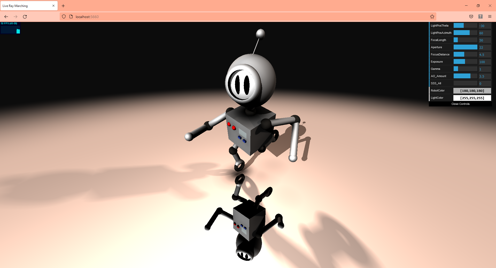
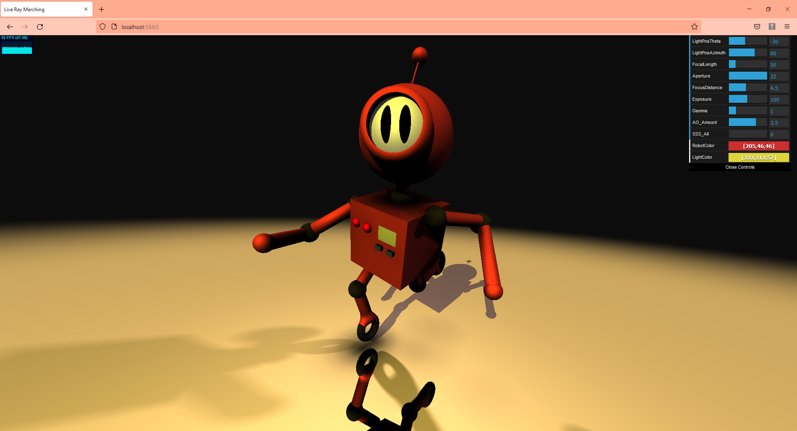
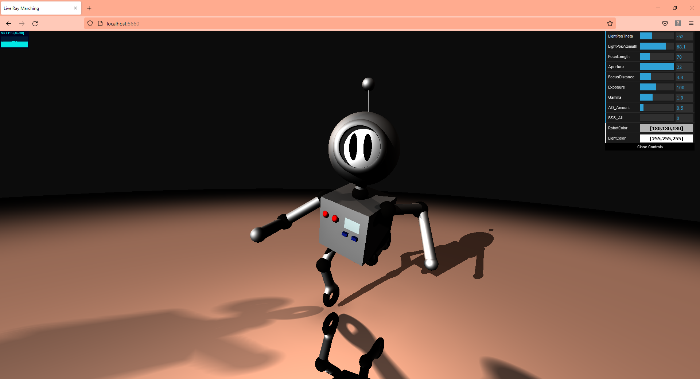

# Signed Distance Function Ray Marching

## Nathan Devlin - @ndevlin - ndevlin@seas.upenn.edu - www.ndevlin.com

## View a live WebGL Demo here!: https://ndevlin.github.io/LiveRayMarching/

## Project Information

This project uses Ray Marching and Signed Distance Functions to render a scene in real-time using only mathematical functions. There is no actual geometry in the scene other than a quad that the scene is rendered upon. Each pixel ray-marches forward to interact with functions corresponding with each piece of geometry in the scene to determine which piece of geometry is closest to the camera. A number of rendering effects are calculated on top of this. These include Blinn-Phong reflection, specular reflection, sub-surface scattering, ambient occlusion, and more. UV mapped textures, Hard and soft shadows, depth of field, and more are also created using algorithms uniquely appropriate for an SDF scene. Check out a live demo using the link above!

This project was created using TypeScript, WebGL, and GLSL. Visual Studio Code, Node.js, and Dat.gui were also utilized.

The SDFs were modeled off of a Robot character I modeled, rigged, and lit in the traditional manner using Maya: 

## User Details

The user can move the camera using their mouse. Left click and drag to tumble the camera. Use the scroll wheel to dolly in and out. Right click and drag to move the camera position in screen space.

In addition, there are a number of user-controllable sliders:

- LightPosTheta: Change the Theta Position of the Key Light
- LightPosAzimuth: Change the azimuth (height) of the Key Light
- FocalLength: Controls the Zoom of the Camera; 20 is most Wide-Angle, 200 is most TelePhoto
- Aperture: Controls the Depth of Field: at 22 everything will be in focus, at 1 the Depth of Field will be at its most shallow (i.e. blurry)
- FocusDistance: The distance of the focal plane from the camera. This will only be noticeable with a small Aperture (i.e. a Shallow Depth of Field)
- Exposure: The percentage above or below 100% standard exposure
- Gamma: Change the contrast of the image. 1 is standard contrast, < 1 high contrast, > 1 lower contrast
- AO_Amount: The amount of Ambient Occlusion rendered. 0 is none, 5 is maximal
- SSS_All: Turns on Sub-Surface Scattering for all materials in the scene.
- RobotColor: Use a Color Picker to select the Albedo color of the robot
- LightColor: Use a Color Picker to select the color of the Key Light

Notes: For reference, the diameter of the robot's head is about 1 unit. By default, only the robot's face and the small panel on the chest use Sub-Surface Scattering. 

### Demo Images:

### Depth of Field

### Ambient Occlusion:

### SubSurface Scattering

### Reflections:

### Modifiable Color:

### Gamma:

## Implementation Details:
Selected information about various algorithms and challenges overcome in implementing various features

- Lens Controls: 
    Enabling the creation of "real" camera controls required a few different techniques. In order to make it work, I added an additional render pass. To begin with, I needed to set up a Post-Processing framework with WebGL. The original ray-marched scene is first rendered and stored to a texture using a Frame Buffer. Depth information is stored to to the alpha channel since all elements in the scene are opaque. Since the first render pass renders everything on a single-pixel basis, each pixel doesn't have any information about it's neighboring pixels. The second pass allows access to the whole image. The second shader reads from the texture to sample neighboring pixels to accomplish a Gaussian blur. This is interpolated according to the depth information stored in the depth channel combined with the FocusDistance value between a fully blurry image and an un-blurred image. This gives the effect of a shallow depth of field. This result is interpolated with an un-blurry image according to the Aperture parameter to simulate a shallower or less shallow depth of field per the user's preference.

- Ambient Occlusion:
    This project utilizes a fast ambient occlusion algorithm to be able to run in real time. The algorithm simply samples along the normal to see if there is nearby geometry (using SDFs); the more geometry detected, the more shadowing results from the ambient occlusion.

- SubSurface Scattering:
    The SubSurface Scattering effect is modeled off of the algorithm given here: https://colinbarrebrisebois.com/2011/03/07/gdc-2011-approximating-translucency-for-a-fast-cheap-and-convincing-subsurface-scattering-look/ Essentially, the algorithm approximates the thickness of the object at a point by running ambient occlusion on the interior of the object. Thus, points that are near other geometry (and thus in an AO pass would be occluded) are marked as thin, whereas those that are not are marked thick. This information is then used in combination with the information about the light direction and viewing angle to calculate a highlight, in a manner not dissimilar to a Blinn-Phong highlight.

- Reflections:
    To calculate reflections, a special reflective material is indicated. If an object is specified as using this material, then in the color calculation step of the algorithm, a ray is shot out to re-march originating at the original intersection location and heading in a direction calculated based on the camera's angle with the surface.

- UV Mapping:
    I created a procedural texture for the robot's face that mathematically describes two ellipses that create the robot's eyes. This texture is then mapped to the robot's face using a UV Mapping function that takes in the position on the sphere and returns the corresponding UV coordinates.

- Tone Mapping:
    Gamma correction and Exposure controls are used to allow the user to modify the contrast and the total brightness of the scene to compensate for different light colors, light angles, etc.

- User Controls:
    Dat.gui is utilized to take in input from the user in real time. This is then piped through WebGL to the shaders where they can modify the image on a per-pixel basis. Beyond the features described above, the user can also control the position and color of the Key light and the Robot's albedo color.

## Process

### Results

I was successfully able to implement all of the features I set out to implement. These were:

- Depth Of Field
- Ambient Occlusion
- SubSurface Scattering

I also added a few additional bonus features to the project, including
- Reflections
- Exposure
- Modifiable Focal Length
- Gamma Correction
- UV Mapping, procedural textures
- Interactive User Controls

I added interactive user controls to enable the user to modify:
- Key Light position
- Key Light Color
- Aperture: Controls the amount of DOF blur
- FocusDistance: How far from the camera the focal plane lies
- Focal Length: Zoom amount: Small Focal length = Wide-Angle, Large Focal length = TelePhoto
- Exposure: Percent above or below 100% default exposure level
- AO Amount: Amount of Ambient Occlusion: More corresponds with greater AO shadowing
- SSS All: By default, the robot's eyes use a Sub-Surface Scattering material, but this control makes everything use SSS to visibly show the effect
- Robot Color: Change the albedo color of the robot

### Post Mortem

I feel that the project went well overall. I was able to implement all of the features I set out to, and a few additional ones as well. 

The Depth Of Field feature turned out to be a lot more challenging to implement than I had expected since I had to add a whole Post Processing framework to my project. 

The other features were more straightforward to implement, but still had some interesting challenges of their own. The ambient occlusion, subsurface scattering, and reflection functionality each had some hurdles and some elements that needed to be tweaked in order to get them looking nice.

Finally, the user interface I felt was very important to give the user a feeling of interactivity, and to really show off the variety of effects implemented. There was a lot of wiring up to do to make all of that functionality work together interactively.

Overall, I was able to achieve all the tasks I had set out to, which I feel was a solid accomplishment.

### Design Specification:

### Goal
- I have been very interested in rendering ever since I started learning about computer graphics! I would like to learn more about rendering techniques while at the same time showing off my graphics, procedural, and rendering knowledge in a polished project. I am hoping to incorporate some more advanced techniques like depth of field, subsurface scattering, and ambient occlusion into the scene. If time and logistics allow, I will also add some additional features like reflections, shadows etc.

### Inspiration/reference:

### Specification:
1) Depth of field rendering
    - Implement a simulated depth of field effect
    - Allow the user to change the focal length and/or the aperture

2) Subsurface scattering
    - Impement simulated subsurface scattering
    - Possibly add different materials that have different materials and different amounts of SSS

3) Ambient Occlusion
    - Implement simulated ambient occlusion
    - Tweak amount of ambient occlusion to enhance the scene as best as possible

4) Reflections
    - Add simulated reflections to enhance the scene and give it more detail

